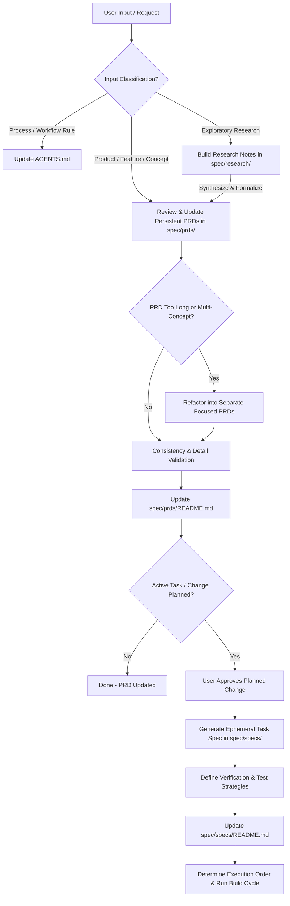

# Agent Workspace Guidance & Specification Rules

## Communication & Diagramming Standards
- **Relative Markdown Links**: Use relative Markdown links for file cross-references (e.g. `[example-spec.md](./spec/specs/example-spec.md)` or `[feature-prd.md](./spec/prds/feature-prd.md)`). Do NOT use `file:///` URLs inside Markdown files as IDE previewers cannot click them.
- **Mermaid Diagrams**: When describing domain concepts, system architectures, data flows, sequence flows, or process lifecycles, **always use Mermaid diagrams** (`mermaid` code blocks).

## Input Routing & Classification Rules
- **Process & Workflow Inputs**: When the user provides feedback or instructions regarding *how we work*, development workflows, file locations, or process rules, immediately capture and document them in **[AGENTS.md](./AGENTS.md)**.
- **Research Inputs**: When the user requests exploratory research, technology evaluations, or background analysis, document the findings in **[spec/research/](./spec/research/)**. Use these research documents to inform and synthesize content into PRDs.
- **Product, Concept, & Feature Inputs**: When the user provides feedback or instructions regarding *what the system does*, new concepts, data models, or product capabilities, guide and capture those inputs into persistent PRDs in **[spec/prds/](./spec/prds/)**.

---

## Product & Task Workflow Rules

### Research Phase (`spec/research/`)
1. **Build Research Base**: When research is requested, store technical evaluations, trade-offs, and exploratory findings in `spec/research/`.
2. **Indexing**: Update [spec/research/README.md](./spec/research/README.md) using relative links whenever a research document is created or updated.
3. **Synthesis**: Review research findings with the user and use them to construct or refine persistent PRDs in `spec/prds/`.

### Phase 1: Feature Evaluation & Persistent PRD Management (`spec/prds/`)
1. **Source of Truth**: PRDs in `spec/prds/` are persistent documents representing the system's baseline architecture, capabilities, and domains.
2. **Review Existing PRDs**: When a new feature or capability is requested, first review existing PRDs in `spec/prds/` to determine if it fits within an existing PRD or warrants a new one.
3. **Modular PRD Structure**: If a PRD becomes too long or begins covering multiple distinct domain concepts, refactor it into separate, focused PRDs.
4. **Consistency & Detail Check**: Verify that new PRD requirements contain sufficient detail and do not contradict existing features or architectural objectives.
5. **Pattern & Journey Sync**: Whenever implementation updates alter design patterns, constraints, or end-to-end user journeys, immediately sync and update the corresponding PRD files in `spec/prds/`.

### Phase 2: Ephemeral Task Specifications (`spec/specs/`)
1. **Task-Specific & Ephemeral**: Spec files in `spec/specs/` are **not** created as persistent baseline documentation. They are generated **only when an active change or task is being planned**, detailing the specific delta, affected files, manifests, schemas, and execution plan.
2. **Spec Status Lifecycle (`draft` -> `complete` -> `deprecated`)**:
   - **`draft`**: Spec is actively being authored or refined prior to implementation. Modifications are allowed **only** while in `draft` status.
   - **`complete`**: Marked once the task changes and verification tests are fully implemented. **A complete spec cannot be modified** except to transition its status to `deprecated`.
   - **`deprecated`**: Marked when a historical spec is superseded by a newer spec. Preserved for auditability.
3. **Clear Verification Strategy**: Every task spec file must clearly define:
   - Expected operational outcomes, manifests, schemas, or payload contracts for the change.
   - Comprehensive test and verification strategy.
4. **Indexing & Linking**: Update `spec/specs/README.md` using relative Markdown links when task specs are added or transitioned.

### Phase 3: Ordered Build & Implementation
1. **Dependency Sequencing**: Determine the appropriate build order across all related spec files.
2. **Feature Branch & PR Workflow**: **Do NOT push directly to the `main` branch**. Always create a dedicated feature branch (e.g. `feat/network-policies`), commit changes to the feature branch, push the feature branch to `origin`, and open a Pull Request (PR) using `gh pr create`.
3. **Execution**: Build out changes following the spec's defined verification strategy.
4. **Per-Spec Verification Gate**: After completing implementation of a spec file, run all relevant unit tests, linters, and verification checks. Confirm clean pass before transitioning spec status to `complete` and progressing to the next spec file.
5. **Pull Request Validation Checks**: Every PR must pass all required CI/CD validation status checks.
