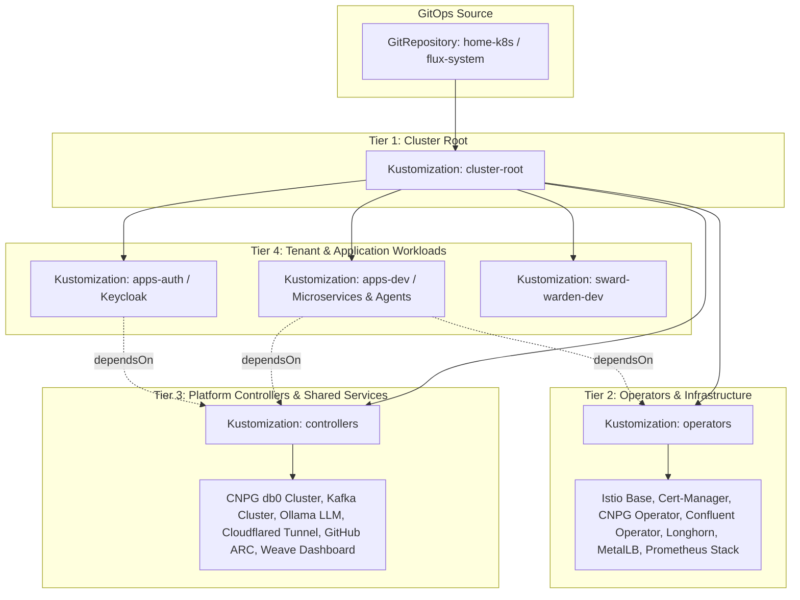

# PRD: GitOps Core Architecture & Multi-Tier Layering

## 1. Overview & Vision
The `home-k8s` repository defines a production-grade, GitOps-driven Kubernetes platform. The primary goal is total declarative infrastructure and workload management via **Flux CD v2**, structured into decoupled, multi-tiered layers. All system state—from bare-metal networking and storage operators to application microservices—is continuously reconciled from this repository.

## 2. Architecture & Layering Model

## 3. Directory Layout & Dependency Ordering

The repository separates bootstrap manifests, operator charts, shared infrastructure controllers, and application tenants:

| Path | Purpose | Flux Reconciliation Role |
|---|---|---|
| `clusters/home-k8s/` | Root cluster definitions & entry points | Top-level Flux Kustomizations with explicit `dependsOn` |
| `infrastructure/operators/` | HelmRepositories & HelmReleases for core operators | Foundation Tier (Operators, Storage, Networking CRDs) |
| `base/controllers/` | Concrete instances of platform controllers & clusters | Shared Tier (Databases, Message Brokers, Ingress Gateways) |
| `base/apps-auth/` | Keycloak IAM and authentication infrastructure | Identity & Access Tier |
| `base/apps-dev/` | Development workloads, agent services, and topics | Application Tier |
| `base/sward-warden-dev/` | Sward Warden application suite | Domain Service Tier |

## 4. Key Functional Requirements

### 4.1 Tier Dependency Enforcement
* Flux Kustomizations for application workloads (`apps-dev`, `apps-auth`) must declare `dependsOn` rules referencing `operators` and `controllers`.
* Infrastructure operators must be healthy and CRDs established before controller instances are applied.

### 4.2 Reconciliation Intervals & Self-Healing
* GitRepository resources poll at `1m` intervals for rapid feedback on changes.
* Kustomizations and HelmReleases enforce pruning (`prune: true`) and automatic drift detection with scheduled reconciliations (5m–60m intervals).

### 4.3 Tenant Isolation
* Resources are strictly segregated by namespaces (e.g. `flux-system`, `istio-system`, `confluent`, `dbs`, `auth`, `dev`, `ollama`, `sward-warden-dev`).

## 5. Non-Functional Requirements
* **Determinism**: Manifests must not use floating mutable tags where deterministic Helm chart versions or image digests are required.
* **Observability**: Reconcile status and health conditions must be queryable via Flux CLI (`flux get kustomizations`) and the Weave GitOps dashboard.
* **Zero-Touch Bootstrap**: New clusters must bootstrap cleanly from `clusters/home-k8s/` without requiring ad-hoc `kubectl apply` commands beyond initial secrets and flux bootstrap.

## 6. Related Specifications & PRDs
* [002-infrastructure-operators-and-storage-prd.md](./002-infrastructure-operators-and-storage-prd.md)
* [003-networking-service-mesh-and-ingress-prd.md](./003-networking-service-mesh-and-ingress-prd.md)
* [004-identity-and-secret-distribution-prd.md](./004-identity-and-secret-distribution-prd.md)
* [005-data-persistence-and-streaming-prd.md](./005-data-persistence-and-streaming-prd.md)
* [006-workloads-ai-and-ephemeral-environments-prd.md](./006-workloads-ai-and-ephemeral-environments-prd.md)
* [007-agent-as-data-workload-prd.md](./007-agent-as-data-workload-prd.md)
