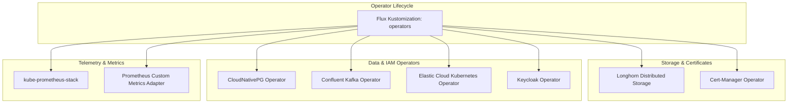

# PRD: Infrastructure Operators & Storage Management

## 1. Overview & Vision
The infrastructure operators tier provides the baseline capabilities required by workloads across the cluster. This includes distributed block storage (Longhorn), TLS certificate lifecycle automation (Cert-Manager), database and messaging operators (CloudNativePG, Confluent Operator, ECK, Keycloak Operator), and Prometheus-based monitoring infrastructure.

## 2. Component Architecture

## 3. Core Functional Capabilities

### 3.1 Distributed Block Storage (Longhorn)
* **Storage Classes**: Provision persistent volumes backed by Longhorn storage across bare-metal nodes.
* **Resilience**: Configurable volume replica count to tolerate node failure.
* **Volume Snapshots & Backup**: Support volume backup targets for critical persistent storage (databases, message queues, model caches).

### 3.2 Certificate Management (Cert-Manager)
* **CRD Management**: Automated issuance and renewal of TLS certificates via `Certificate` and `Issuer`/`ClusterIssuer` CRDs.
* **Mesh & Ingress Integration**: Supplying valid TLS secrets to Istio gateways and internal services.

### 3.3 Custom Resource Controllers (Operators)
* **CloudNativePG Operator**: Manages high-availability PostgreSQL clusters, automated failover, backups, and user credential secrets.
* **Confluent for Kubernetes (CFK) Operator**: Manages declarative Kafka clusters, KafkaTopics, and schema registries.
* **Keycloak Operator**: Reconciles Keycloak instances, custom realms, and client configurations.
* **Elasticsearch Operator (ECK)**: Reconciles Elasticsearch and Kibana clusters.

### 3.4 Monitoring & Metric Aggregation
* **kube-prometheus-stack**: Deploys Prometheus, Alertmanager, and Grafana instances with default cluster scraping.
* **Prometheus Adapter**: Exposes custom and external metrics to the Kubernetes Custom Metrics API for Horizontal Pod Autoscaling (HPA).

## 4. Operational Requirements
* **Operator Upgradability**: HelmReleases specify defined chart versions or automated minor semver matching with retries and auto-rollback.
* **Namespace Isolation**: Each operator runs in its dedicated system namespace (e.g. `longhorn-system`, `cert-manager`, `cnpg-system`, `confluent`, `monitoring`).

## 5. Related Specifications & PRDs
* [001-gitops-core-architecture-prd.md](./001-gitops-core-architecture-prd.md)
* [003-networking-service-mesh-and-ingress-prd.md](./003-networking-service-mesh-and-ingress-prd.md)
* [005-data-persistence-and-streaming-prd.md](./005-data-persistence-and-streaming-prd.md)
