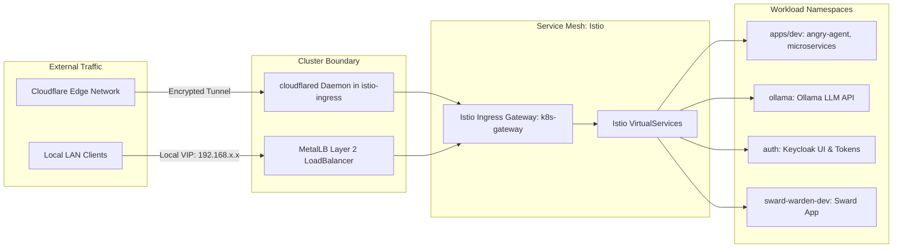

# PRD: Networking, Service Mesh & Ingress Management

## 1. Overview & Vision
The networking architecture of `home-k8s` provides secure internal service-to-service communication via **Istio Service Mesh**, bare-metal IP load balancing via **MetalLB**, and secure remote ingress via **Cloudflare Zero-Trust Tunnels** (`cloudflared`).

## 2. Ingress & Traffic Flow Architecture

## 3. Core Networking Capabilities

### 3.1 Bare-Metal Load Balancing (MetalLB)
* Allocates dedicated VIPs from the local network address pool to Kubernetes `LoadBalancer` services.
* Enforces layer-2 advertisement to route local LAN traffic directly to the Istio Ingress Gateway.

### 3.2 Istio Service Mesh & Gateway
* **Mesh Infrastructure**: Deployed via `istio-base` and `istiod` Helm charts with automatic sidecar injection enabled for target namespaces.
* **Unified Gateway**: Single `Gateway` (`k8s-gateway`) handling HTTP/HTTPS host matching and TLS termination.
* **VirtualServices**: Declarative routing for microservices, web shells, and local inference APIs (e.g. `*.k8s` internal domains and public FQDNs).

### 3.3 Zero-Trust Remote Ingress (Cloudflare Tunnel)
* `cloudflared` runs as a cluster deployment in the `istio-ingress` namespace.
* Authenticates outbound to the Cloudflare edge using token secrets (`cloudflared-token`), eliminating the need to expose inbound router ports.
* Routes ingress traffic directly into the local `istio-ingressgateway`.

## 4. Security & Performance Requirements
* **Mutual TLS (mTLS)**: Istio mesh handles transparent mutual TLS encryption between internal services.
* **Resilience**: `cloudflared` deployment and Istio gateways configured with health checks and restart policies.
* **No Inbound Port Forwarding**: External access must route exclusively via the Cloudflare Tunnel.

## 5. Related Specifications & PRDs
* [001-gitops-core-architecture-prd.md](./001-gitops-core-architecture-prd.md)
* [004-identity-and-secret-distribution-prd.md](./004-identity-and-secret-distribution-prd.md)
* [006-workloads-ai-and-ephemeral-environments-prd.md](./006-workloads-ai-and-ephemeral-environments-prd.md)
* [007-agent-as-data-workload-prd.md](./007-agent-as-data-workload-prd.md)
