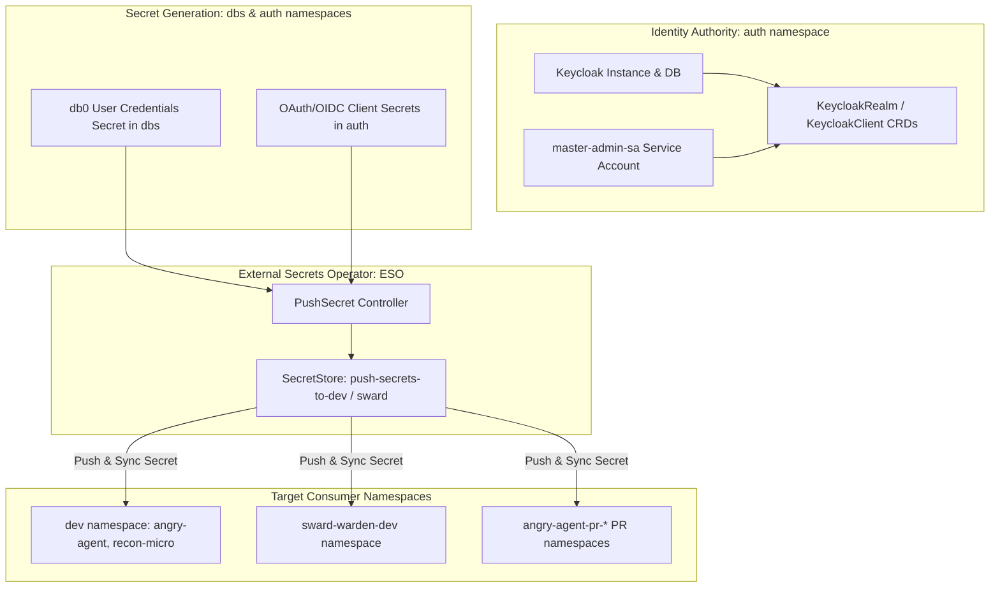

# PRD: Identity, Access & Cross-Namespace Secret Distribution

## 1. Overview & Vision
Managing authentication, authorization, and secure credential sharing across decoupled Kubernetes namespaces is a critical platform requirement. This PRD defines the architecture for centralized identity via **Keycloak** and automated cross-namespace secret synchronization via the **External Secrets Operator (ESO)** using the `PushSecret` pattern.

## 2. Security & Identity Topology

## 3. Core Functional Capabilities

### 3.1 Centralized IAM (Keycloak Operator & CRDs)
* **Instance Management**: High-availability Keycloak deployment in `auth` namespace backed by PostgreSQL.
* **Declarative Realm Provisioning**: Keycloak realms, roles, clients, and service accounts managed declaratively via CRDs (`KeycloakRealm`, `KeycloakClient`).
* **Bootstrap Service Account**: Dedicated admin service account (`master-admin-sa`) enabling Flux to continuously reconcile realm definitions.

### 3.2 Cross-Namespace Secret Distribution (ESO PushSecrets)
* **Push-Based Architecture**: Rather than pulling from an external vault, the cluster uses in-cluster `SecretStore` configurations targeting destination namespaces via local ServiceAccount RBAC (`RoleBinding` to `sa-externalsecret`).
* **Automated Sync**: `PushSecret` resources in source namespaces (e.g. `dbs`, `auth`) push credentials directly to target consumer namespaces (`dev`, `sward-warden-dev`, ephemeral PR namespaces).
* **Credential Rotation & Cleanup**:
  * `updatePolicy: Replace` to ensure instant updates on credential rotation.
  * `deletionPolicy: Delete` to purge destination secrets when the source `PushSecret` is removed.

### 3.3 Registry Authentication Sharing
* Automatic distribution of GitHub Container Registry (`ghcr.io`) pull secrets across tenant and ephemeral namespaces to authorize private image pulling.

## 4. Security & Compliance Requirements
* **Least Privilege RBAC**: `sa-externalsecret` permissions are scoped via rolebindings strictly to allowed target namespaces.
* **No Plaintext Secrets in Git**: Git repositories only contain declarative `PushSecret` and `SecretStore` definitions; actual sensitive credentials remain in generated Kubernetes Secret objects or are injected during initial cluster bootstrapping.

## 5. Related Specifications & PRDs
* [001-gitops-core-architecture-prd.md](./001-gitops-core-architecture-prd.md)
* [005-data-persistence-and-streaming-prd.md](./005-data-persistence-and-streaming-prd.md)
* [006-workloads-ai-and-ephemeral-environments-prd.md](./006-workloads-ai-and-ephemeral-environments-prd.md)
* [007-agent-as-data-workload-prd.md](./007-agent-as-data-workload-prd.md)
