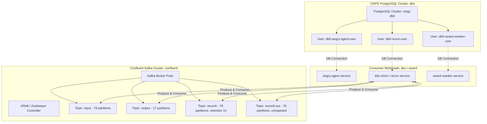

# PRD: Data Persistence & Event Streaming

## 1. Overview & Vision
Applications hosted in the cluster require robust, declarative relational database management and high-throughput distributed event streaming. This PRD details the infrastructure for PostgreSQL clusters managed via **CloudNativePG (CNPG)** and Apache Kafka clusters managed via the **Confluent for Kubernetes Operator (CFK)**.

## 2. Persistence & Streaming Architecture

## 3. Core Functional Capabilities

### 3.1 CloudNativePG (PostgreSQL) Management
* **Cluster Deployment**: Declarative PostgreSQL clusters (`cnpg-db0`) in the `dbs` namespace with configurable instances, storage sizes, and backup schedules.
* **Declarative User & Database Provisioning**: Dedicated user CRDs for each workload:
  * `db0-angry-agent-user`
  * `db0-recon-user`
  * `db0-sward-warden-user`
  * `db0-agent-as-data-user`
* **Automated Credential Generation**: Passwords generated and stored automatically in Kubernetes secrets and synced via ESO.

### 3.2 Confluent Kafka Event Streaming
* **Cluster Provisioning**: Production-grade Kafka cluster orchestrated via `platform.confluent.io/v1beta1`.
* **Declarative Kafka Topics**: Dedicated `KafkaTopic` CRDs defining partition counts, replication factors, and retention/compaction policies:
  * `input`: 79 partitions, delete policy.
  * `output`: 17 partitions, delete policy.
  * `recon0`: 79 partitions, 1-hour retention (`retention.ms: 36000000`), 10-minute delete retention.
  * `recon0-out`: 79 partitions, log compaction (`cleanup.policy: compact`).

## 4. Reliability & Performance Requirements
* **Data Durability**: Persistent storage provisioned via Longhorn storage classes with data protection across node restarts.
* **Failover & High Availability**: Automated primary election and replica synchronization handled natively by CNPG and Kafka operators.
* **Partition Scaling**: High partition counts (e.g. 79 partitions) configured to support high-concurrency parallel consumers.

## 5. Related Specifications & PRDs
* [001-gitops-core-architecture-prd.md](./001-gitops-core-architecture-prd.md)
* [004-identity-and-secret-distribution-prd.md](./004-identity-and-secret-distribution-prd.md)
* [006-workloads-ai-and-ephemeral-environments-prd.md](./006-workloads-ai-and-ephemeral-environments-prd.md)
* [007-agent-as-data-workload-prd.md](./007-agent-as-data-workload-prd.md)
