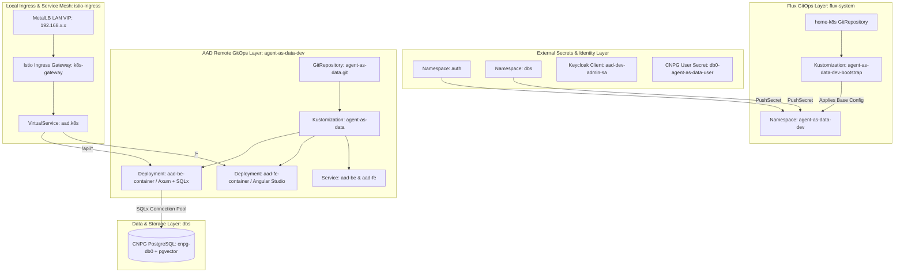
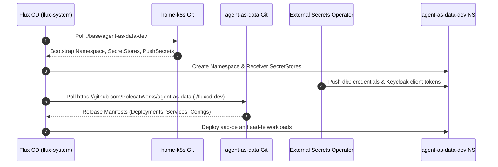
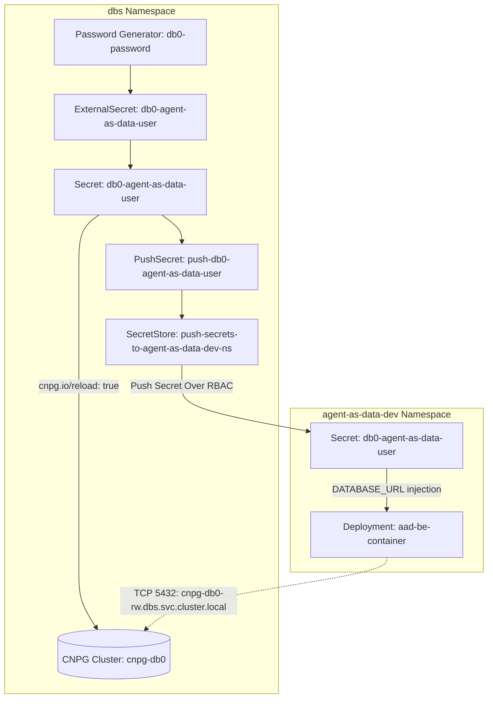
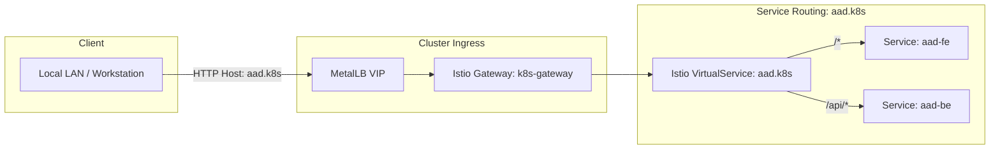

# PRD: Agent-As-Data (AAD) Workload & Local Ingress Integration

## 1. Overview & Vision
This PRD defines the deployment, GitOps integration, cross-namespace secret distribution, data persistence, and local-only ingress architecture for **Agent-As-Data (AAD)** (`https://github.com/PolecatWorks/agent-as-data`).

Agent-As-Data represents AI agents as structured, queryable data in PostgreSQL rather than imperative code, pairing a high-performance Rust backend service (`aad-be-container`) with an Angular Studio frontend dashboard (`aad-fe-container`). Following the established multi-tier deployment pattern exemplified by `sward-warden-dev`, AAD is continuously deployed via Flux CD v2, receives database and IAM credentials via External Secrets Operator (ESO) `PushSecret` resources, connects to the local `cnpg-db0` PostgreSQL cluster, and is exposed strictly internally on the local network under the `aad.k8s` (or `agent-as-data.k8s`) domain via Istio Ingress Gateway without public Cloudflare tunnel exposure.

---

## 2. System Architecture & Topology

---

## 3. Core Functional Capabilities

### 3.1 Isolated Workload Namespace (`agent-as-data-dev`)
* **Namespace Provisioning**: Managed under `base/agent-as-data-dev/namespace.yaml` with required tenancy, monitoring, and mesh labels:
  * `istio-injection: enabled`
  * `toolkit.fluxcd.io/tenant: app`
  * `monitoring/prometheus-stack: dev`
  * `app.kubernetes.io/part-of: flux`
* **RBAC & Security**: ServiceAccount definitions and GHCR image-pull permissions for pulling private container images from `ghcr.io/polecatworks/agent-as-data/*`.

### 3.2 Multi-Repo GitOps Bootstrap Lifecycle
* **Root Cluster Kustomization (`clusters/home-k8s/agent-as-data-dev.yaml`)**:
  * Watches `home-k8s` Git repository at path `./base/agent-as-data-dev`.
  * Enforces `dependsOn: controllers` to guarantee CRDs, Istio, and ESO operators are ready before workload reconciliation.
* **App GitRepository & Kustomization (`base/agent-as-data-dev/deployment.yaml`)**:
  * Declares `GitRepository` referencing `https://github.com/PolecatWorks/agent-as-data.git` (`branch: main`) authenticated via GitHub PAT secret (`aad-gh-pat`).
  * Declares `Kustomization` targeting the remote `./fluxcd-dev` manifest directory with target namespace `agent-as-data-dev`.

### 3.3 PostgreSQL Database Provisioning (`cnpg-db0`) & Secret Flow
Following the exact `sward-warden` persistence pattern:
* **CNPG Role & Database Definition (`base/controllers/cnpg-db0/cnpg-db0.yaml`)**:
  * **Role**: `db0_agent_as_data` with `ensure: present`, `login: true`, and `passwordSecret.name: db0-agent-as-data-user`.
  * **Database**: `agent_as_data` owned by `db0_agent_as_data` with the `vector` (`pgvector`) extension enabled.
* **Credential Generation (`base/controllers/cnpg-db0/db0-agent-as-data-user.yaml`)**:
  * `ExternalSecret` in `dbs` namespace generating a 32-character random password using generator `db0-password` and labeling the target secret with `cnpg.io/reload: "true"` for automatic in-flight credential reload without downtime.
* **Cross-Namespace Secret Distribution (`base/agent-as-data-dev/push-db0-secret.yaml`)**:
  * `PushSecret` in `dbs` namespace pushing `db0-agent-as-data-user` (`username` and `password`) to the target secret in `agent-as-data-dev` namespace via `push-secrets-to-agent-as-data-dev-ns` `SecretStore`.
* **Database Connection Ingress & Schema Migrations**:
  * Rust backend (`aad-be-container`) uses `SQLx` connection pooling with automatic migrations applied on pod bootstrap.

### 3.4 Identity & Cross-Namespace IAM Secret Distribution
* **IAM / Keycloak Authentication**:
  * `base/apps-auth/auth-agent-as-data.yaml`: Provisions Keycloak client `aad-dev-admin-sa` and service account roles.
  * `base/agent-as-data-dev/push-realm-secret.yaml`: `PushSecret` in `auth` distributing client credentials to `agent-as-data-dev`.
* **GHCR Container Registry Authentication**:
  * `base/agent-as-data-dev/push-ghcr-docker-auth.yaml`: Pushes `ghcr-docker-auth` secret to allow pod image pulls.

### 3.5 Local Ingress & Network Routing (No Public Ingress)
* **Local Ingress Only**:
  * Exposed exclusively on the local network under `aad.k8s` (or `agent-as-data.k8s`).
  * Routes traffic from local LAN clients through **MetalLB Layer 2 VIP** to **Istio Ingress Gateway** (`k8s-gateway`).
* **Zero Public Exposure Policy**:
  * **No Cloudflare Tunnel (`cloudflared`) configuration** or public DNS exposure shall be created for this workload.
  * Traffic must remain private to internal LAN / VPN / mesh boundaries.
* **Istio VirtualService Routing**:
  * Directs `/api/*`, `/health`, and WebSocket endpoints to `aad-be-container` (Port 8080 / 3000).
  * Directs root and UI paths `/*` to `aad-fe-container` (Port 80 / 4200).

---

## 4. Operational, Storage & Telemetry Requirements
* **Data Persistence**: Connects to `cnpg-db0` with extension `pgvector` enabled for agent embedding storage and vector retrieval.
* **Monitoring & Observability**: Integrated with Prometheus service monitors and Vector/Loki log shipping via `telemetry-logs.yaml`.
* **Health Probes**: Rust backend provides `/health` or `/livez` HTTP endpoints; Angular frontend serves static assets with Nginx health checks.

---

## 5. Related Specifications & PRDs
* [001-gitops-core-architecture-prd.md](./001-gitops-core-architecture-prd.md)
* [003-networking-service-mesh-and-ingress-prd.md](./003-networking-service-mesh-and-ingress-prd.md)
* [004-identity-and-secret-distribution-prd.md](./004-identity-and-secret-distribution-prd.md)
* [005-data-persistence-and-streaming-prd.md](./005-data-persistence-and-streaming-prd.md)
* [006-workloads-ai-and-ephemeral-environments-prd.md](./006-workloads-ai-and-ephemeral-environments-prd.md)
