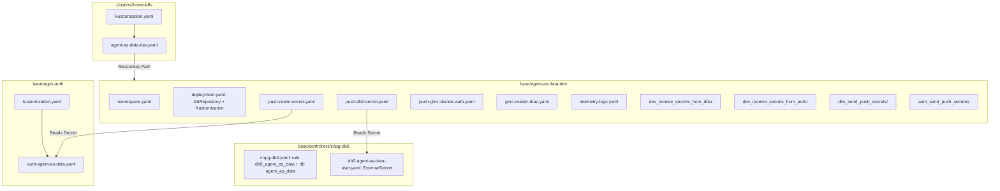

# Spec: Agent-As-Data (AAD) Workload Deployment & PostgreSQL Integration

## Status: `complete`

## 1. Overview & Objectives
Deploy **Agent-As-Data (AAD)** (`https://github.com/PolecatWorks/agent-as-data`) to the `home-k8s` GitOps cluster adhering strictly to the `sward-warden` multi-tier deployment pattern.

Key objectives:
1. **Isolated Namespace**: Provision `agent-as-data-dev` with Istio sidecar injection and Prometheus monitoring labels.
2. **GitOps Root Bootstrap**: Declare `agent-as-data-dev-bootstrap` Kustomization in `clusters/home-k8s/`.
3. **Application GitOps Reconciliation**: Declare `GitRepository` (`branch: main`, secret `aad-gh-pat`) and `Kustomization` pointing to `./fluxcd-dev`.
4. **PostgreSQL Database & User Provisioning**:
   - Add `db0_agent_as_data` role and `agent_as_data` database (with `vector` extension) to `cnpg-db0.yaml`.
   - Add `db0-agent-as-data-user.yaml` ExternalSecret in `dbs` namespace.
   - Configure `PushSecret` to distribute DB credentials from `dbs` into `agent-as-data-dev`.
5. **IAM & Secret Distribution**:
   - Provision Keycloak client & credentials in `base/apps-auth/auth-agent-as-data.yaml`.
   - Configure `PushSecret` to distribute Keycloak credentials and GHCR docker credentials to `agent-as-data-dev`.
6. **Local-Only Ingress**:
   - Restrict exposure strictly to local network via Istio `k8s-gateway` under `aad.k8s` (no Cloudflare tunnel exposure).

---

## 2. Architecture & Manifest Graph

---

## 3. Affected Files & Manifest Changes

| Action | File Path | Description |
|---|---|---|
| `MODIFY` | `base/controllers/cnpg-db0/cnpg-db0.yaml` | Add `db0_agent_as_data` role & `agent_as_data` database with `vector` extension |
| `NEW` | `base/controllers/cnpg-db0/db0-agent-as-data-user.yaml` | ExternalSecret for `db0_agent_as_data` user password generator |
| `NEW` | `base/apps-auth/auth-agent-as-data.yaml` | Keycloak client, external secret, and push secret for AAD |
| `MODIFY` | `base/apps-auth/kustomization.yaml` | Include `auth-agent-as-data.yaml` in `apps-auth` kustomization |
| `NEW` | `clusters/home-k8s/agent-as-data-dev.yaml` | Flux bootstrap Kustomization for `agent-as-data-dev` |
| `MODIFY` | `clusters/home-k8s/kustomization.yaml` | Add `agent-as-data-dev.yaml` to cluster root resources |
| `NEW` | `base/agent-as-data-dev/namespace.yaml` | Namespace declaration for `agent-as-data-dev` with labels |
| `NEW` | `base/agent-as-data-dev/deployment.yaml` | Flux GitRepository & Kustomization tracking `./fluxcd-dev` |
| `NEW` | `base/agent-as-data-dev/push-db0-secret.yaml` | ESO PushSecret syncing `db0-agent-as-data-user` to namespace |
| `NEW` | `base/agent-as-data-dev/push-realm-secret.yaml` | ESO PushSecret syncing Keycloak client secret to namespace |
| `NEW` | `base/agent-as-data-dev/push-ghcr-docker-auth.yaml` | ESO PushSecret syncing GHCR pull credentials |
| `NEW` | `base/agent-as-data-dev/ghcr-reader-rbac.yaml` | ServiceAccount & RBAC token for secret store |
| `NEW` | `base/agent-as-data-dev/telemetry-logs.yaml` | Envoy access logging telemetry configuration |
| `NEW` | `base/agent-as-data-dev/dev_enable_receive_secrets/kustomization.yaml` | Enable ESO secret receiver |
| `NEW` | `base/agent-as-data-dev/dev_receive_secrets_from_dbs/kustomization.yaml` | Authorize secret push from `dbs` namespace |
| `NEW` | `base/agent-as-data-dev/dev_receive_secrets_from_auth/kustomization.yaml` | Authorize secret push from `auth` namespace |
| `NEW` | `base/agent-as-data-dev/dbs_send_push_secrets/kustomization.yaml` | Configure `dbs` SecretStore remoteNamespace |
| `NEW` | `base/agent-as-data-dev/auth_send_push_secrets/kustomization.yaml` | Configure `auth` SecretStore remoteNamespace |

---

## 4. Execution Plan & Implementation Steps

1. **Step 1: CNPG Database & User Definition**:
   - Update `base/controllers/cnpg-db0/cnpg-db0.yaml` to register role `db0_agent_as_data` and database `agent_as_data` with `vector` extension.
   - Create `base/controllers/cnpg-db0/db0-agent-as-data-user.yaml`.
2. **Step 2: Keycloak IAM Client Definition**:
   - Create `base/apps-auth/auth-agent-as-data.yaml`.
   - Update `base/apps-auth/kustomization.yaml`.
3. **Step 3: Agent-As-Data Base & ESO Integration**:
   - Create directory `base/agent-as-data-dev/` and all sub-kustomizations (`dev_enable_receive_secrets`, `dev_receive_secrets_from_dbs`, `dev_receive_secrets_from_auth`, `dbs_send_push_secrets`, `auth_send_push_secrets`).
   - Create `namespace.yaml`, `deployment.yaml`, `push-db0-secret.yaml`, `push-realm-secret.yaml`, `push-ghcr-docker-auth.yaml`, `ghcr-reader-rbac.yaml`, and `telemetry-logs.yaml`.
4. **Step 4: Cluster Root Bootstrap**:
   - Create `clusters/home-k8s/agent-as-data-dev.yaml`.
   - Update `clusters/home-k8s/kustomization.yaml`.
5. **Step 5: Validation & Verification Gate**:
   - Run `kustomize build` on all affected directories (`base/controllers/cnpg-db0`, `base/apps-auth`, `base/agent-as-data-dev`, `clusters/home-k8s`).
   - Validate YAML schemas and verify zero Cloudflare ingress resources are exposed.

---

## 5. Verification Strategy & Acceptance Criteria

### Verification Checks
1. `kustomize build base/controllers/cnpg-db0` renders clean CNPG cluster with `db0_agent_as_data` role, `agent_as_data` database with `vector` extension, and `db0-agent-as-data-user` ExternalSecret.
2. `kustomize build base/apps-auth` renders Keycloak client, external secret, and push secret.
3. `kustomize build base/agent-as-data-dev` renders all secrets, RBAC, GitRepository, and Kustomization without errors.
4. `kustomize build clusters/home-k8s` compiles without broken references.
5. Cloudflare tunnel config (`base/controllers/cloudflared.yaml`) remains untouched with zero public ingress rules for AAD.
